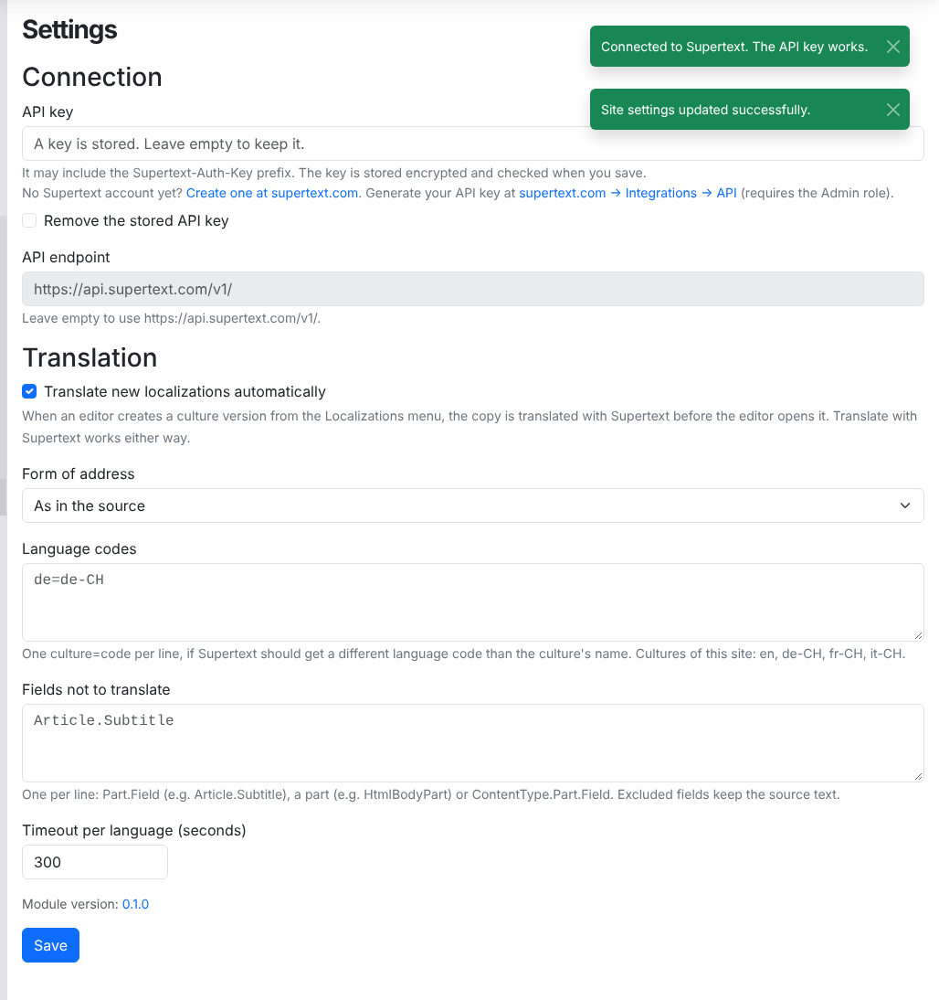
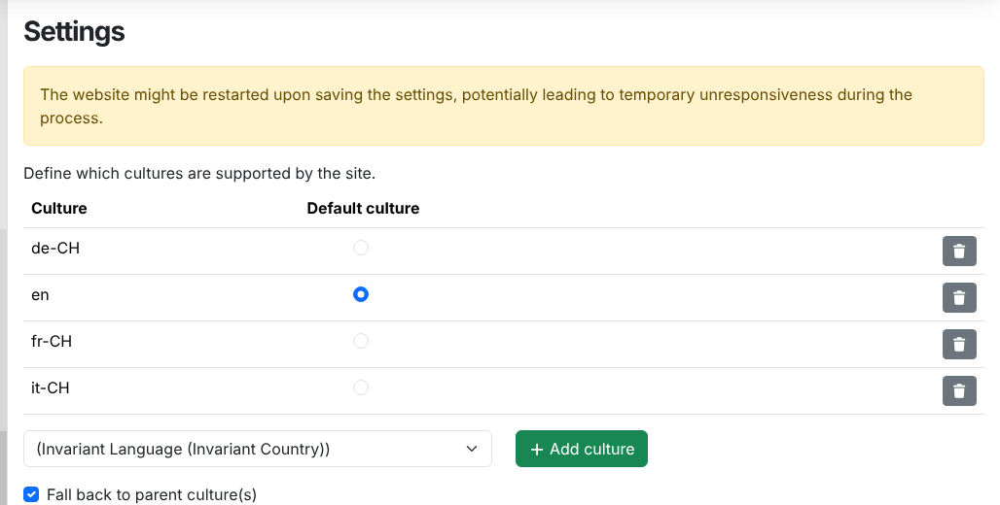

# Installation guide — Supertext Translation for Orchard Core

For administrators who install and configure the module.

## Requirements

- Orchard Core **3.0** (tested with 3.0.1) on .NET 10.
- The Orchard Core features **Localization** and **Content Localization** (the module enables them as dependencies).
- A Supertext account with an API key for AI translation (see [API key](#api-key)).
- The server must reach `https://api.supertext.com` over HTTPS.

## Install

The module is a NuGet package (an Orchard Core module). It is not on nuget.org yet; until then, build it from this repository:

```bash
dotnet pack src/Supertext.OrchardCore.Translation -c Release -o ./packages
```

Then, in your Orchard Core web project, add the package (from that folder as a package source) or reference the project directly:

```bash
dotnet add package Supertext.OrchardCore.Translation --source ./packages
# or
dotnet add reference path/to/src/Supertext.OrchardCore.Translation/Supertext.OrchardCore.Translation.csproj
```

Build and restart the site, then enable the feature on the **Features** page of the admin (`/Admin/Features`): search for **Supertext Translation** and click **Enable**. Orchard Core enables Content Localization along with it.

In a setup recipe, add `"Supertext.OrchardCore.Translation"` to the `feature` step.

## Update

Update the package version (or pull the repository), build and restart. Settings and translations are kept.

## Uninstall

Disable **Supertext Translation** on the **Features** page (`/Admin/Features`), then remove the package reference and rebuild. Translations already created stay as normal content items. The stored settings (in the site settings) stay too; they do no harm.

## API key

**Settings → Supertext** (`/Admin/Settings/supertext`; requires the *Manage Supertext settings* permission; administrators have it).

Get a key first:

- No Supertext account yet? [Log in or create a Supertext account](https://www.supertext.com/person/en/account/signin) with your e-mail address.
- Generate the AI API key at [supertext.com → Integrations → API](https://www.supertext.com/en/integrations/api). This requires the **Admin** role in your Supertext account.

The settings page shows both links below the API key field.

1. Paste the API key. A key copied with its `Supertext-Auth-Key` prefix works too.
2. Click **Save**. The module checks the key with Supertext (free of charge) and shows *Connected to Supertext. The API key works.* or the reason it failed.



The bottom of the page shows the installed **Module version** (read from the module itself). For a release version it links to that release's notes on GitHub; quote it when you contact support.

The key is stored encrypted with ASP.NET Core data protection. It is never shown again; leave the field empty to keep it, or tick **Remove the stored API key**.

**Environment variables win** over the settings page (useful for containers):

| Variable | Configuration key | Meaning |
| --- | --- | --- |
| `SUPERTEXT_API_KEY` | `Supertext:ApiKey` (tenant configuration) | API key. The settings page then shows that the key comes from the environment. |
| `SUPERTEXT_API_ENDPOINT` | `Supertext:Endpoint` | API endpoint, default `https://api.supertext.com/v1/`. The endpoint field is then read-only. |

## Language setup

Translations go from an item's culture into the other cultures of the site. Set the cultures under **Settings → Localization → Cultures** (`/Admin/Settings/localization`): add each language and choose the default (source) culture.



Then make the content types you want to translate localizable: open the type on the **Content Types** page (`/Admin/ContentTypes/List`), click **Add Parts** and add **Localization**. Only types with the *Localization* part show the Supertext buttons.

The culture name is sent to Supertext as the target language (`de-CH`, `fr`, `it-CH` …) and the source culture as its language part (`en-US` → `en`). If Supertext needs a different code, map it under **Language codes** (see below).

A URL per language comes from the type's Autoroute pattern. To give each culture its own prefix, use for example:

```liquid
{{ ContentItem.Content.LocalizationPart.Culture | slice: 0, 2 }}/{{ ContentItem | display_text | slugify }}
```

Translated items get their URL from the translated title when they are saved.

## Permissions

| Permission | Default roles | Allows |
| --- | --- | --- |
| Translate content with Supertext | Administrator, Editor | The *Supertext* buttons and the *Translate with Supertext* page, together with *Localize content* and *Edit content* on the item (the buttons only show when the user has all three). |
| Manage Supertext settings | Administrator | **Settings → Supertext** |

Grant them on the **Roles** page (`/Admin/Roles/Index`).

## All settings

| Setting | Default | Meaning |
| --- | --- | --- |
| API key | – | See above. |
| API endpoint | `https://api.supertext.com/v1/` | Change only for testing. Must be `https` (plain `http` only to `localhost`), because the API key travels with every request. Read-only while `SUPERTEXT_API_ENDPOINT` is set. |
| Translate new localizations automatically | on | When an editor creates a culture version with Orchard Core's *Localizations* menu, the copy is translated before the editor opens it. Off: the copy stays in the source language; *Translate with Supertext* still works. |
| Form of address | As in the source | *Formal* or *Informal* for languages that distinguish them (German *Sie*/*du*, French *vous*/*tu* …). |
| Language codes | – | One `culture=code` per line, e.g. `de=de-CH` if your site uses `de` but you want Swiss German. |
| Fields not to translate | – | One per line (or separated by commas): `Part.Field` (e.g. `Article.Subtitle`), a whole part (e.g. `HtmlBodyPart`) or `ContentType.Part.Field`. These keep the source text. |
| Timeout per language | 300 s | How long to wait for Supertext per language before giving up (30–3600 s). |

## Troubleshooting

| Message or problem | What to do |
| --- | --- |
| *No Supertext API key is configured* / *No Supertext API key is set yet* | Add the key under **Settings → Supertext**, or set `SUPERTEXT_API_KEY`. Generate one at [supertext.com → Integrations → API](https://www.supertext.com/en/integrations/api) (Admin role). |
| *Authentication failed. Please check the Supertext API key.* | The key is wrong or revoked. Paste it again, or generate a new one at [supertext.com → Integrations → API](https://www.supertext.com/en/integrations/api). |
| *The stored Supertext API key could not be decrypted* (log) | The data protection keys changed (e.g. a new container without `App_Data`). Enter the key again, and keep `App_Data` on persistent storage. |
| *Too many requests to Supertext* | The module already retries rate limits 4 times; try again in a minute. |
| *Timed out waiting for the Supertext translation* | Very long items: raise the timeout. |
| *Your Supertext translation limit is exceeded* | Contact Supertext about your plan. |
| No *Supertext* button | The type has no *Localization* part, the item isn't saved yet, or the user lacks *Translate content with Supertext*. |
| *The site has only one culture* | Add cultures (see Language setup). |
| A field stays in the source language | It's excluded, it's not prose (URL, e-mail, number, code editor, color …), or the field type isn't supported (see the user guide). |

The module logs warnings under the category `Supertext.OrchardCore.Translation`.
