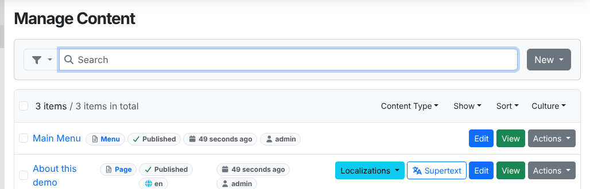
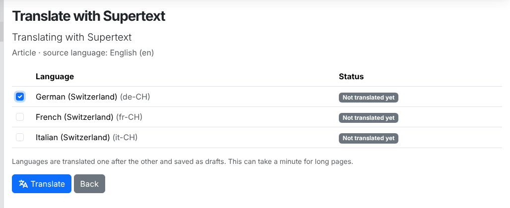
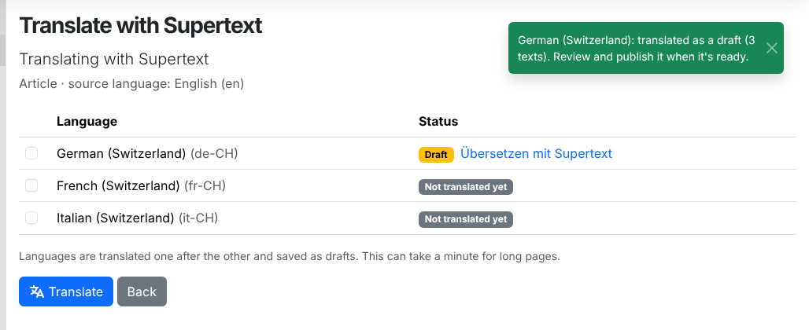
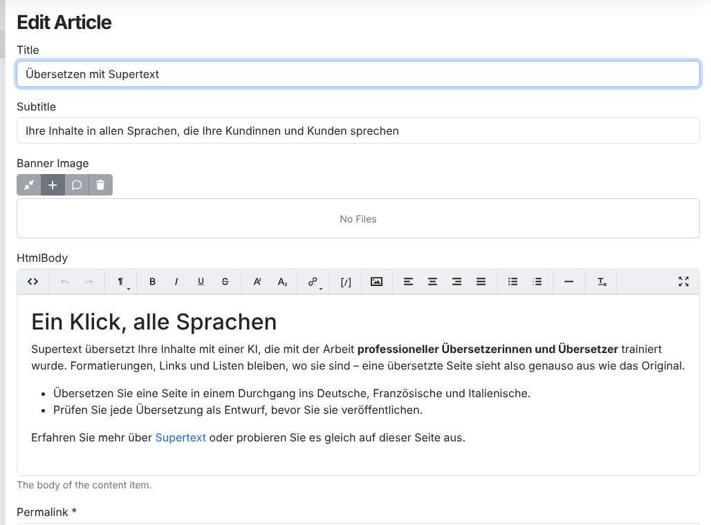
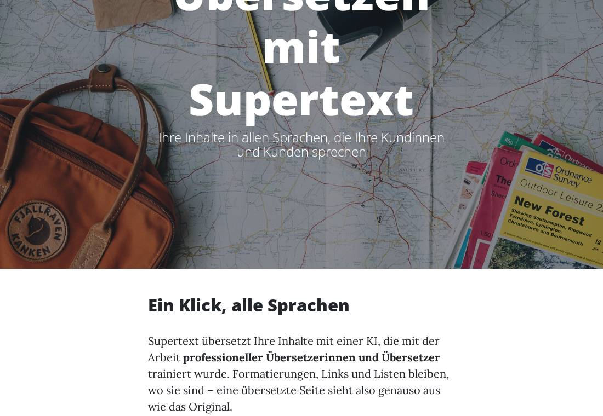
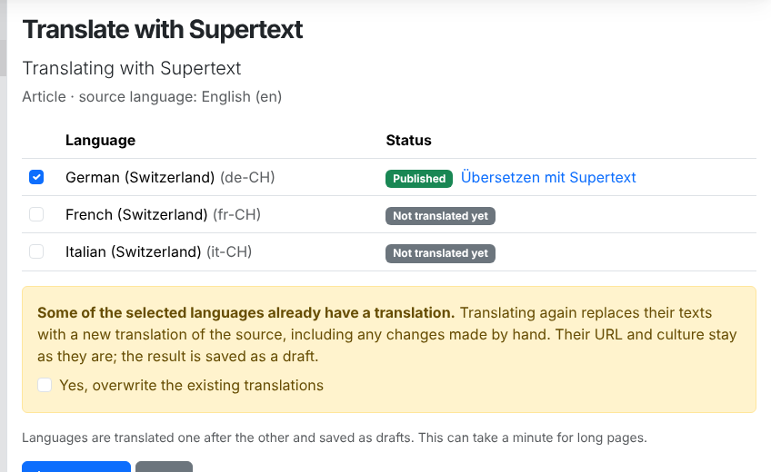
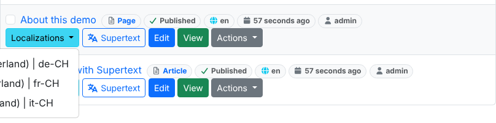
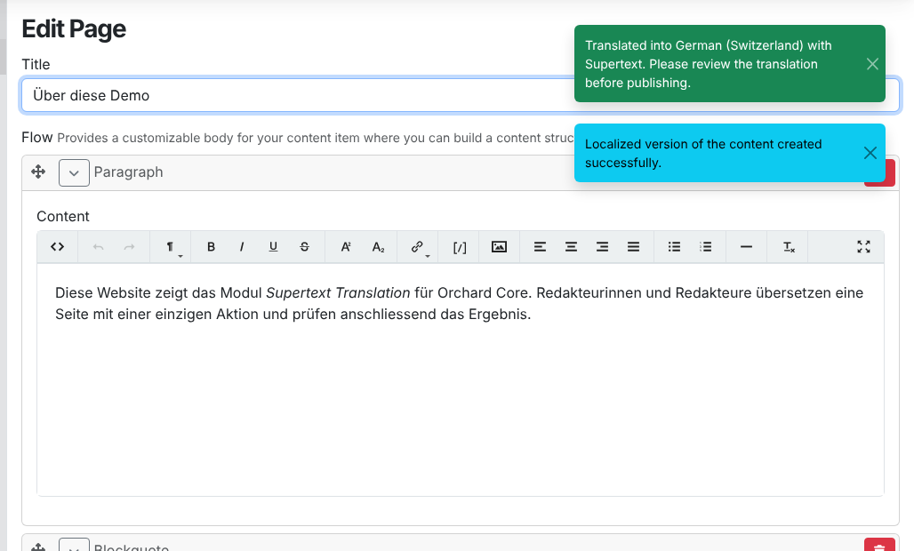

# User guide — Supertext Translation for Orchard Core

For editors who translate content. Your site has one source language (for example English) and some target languages (for example German, French and Italian). Each language version of a page is its own content item, linked to the others as *localizations*.

## Translate a page

1. Open **Content → Content Items**. Pages that can be translated have a **Supertext** button (next to *Localizations*). In the editor, the same action is **Translate with Supertext** at the bottom.

   

2. Tick the languages you want and click **Translate**.

   

3. Supertext translates one language after the other. Each one is saved as a **draft**, and the page shows the result and a link to each translation.

   

The saved version of the source is translated. If you have unsaved changes in the editor, save first.

## Review and publish

Click the link of a translation (or open it from the content list's *Localizations* menu). Check the texts, change what you like, then click **Publish**. The URL is created from the translated title when you save.

## Translate again

If a language already has a translation, Supertext asks first:

Translating again **replaces the texts** of that translation with a new translation of the source, including any corrections you made by hand. The URL and language stay. The result is a new draft, so the published version stays online until you publish.

## Orchard Core's own Localizations menu

You can also create a language version the usual Orchard Core way: **Localizations → + German**. The copy is translated with Supertext before the editor opens, and a message confirms it. (Your administrator can turn this off; then the copy stays in the source language.)

## What is translated

- Title, HTML body, Markdown body
- Text fields (normal and multi-line), HTML fields, Markdown fields, the text of link fields, alt texts of images
- Widgets inside Flow, Bag and Widgets List parts (for example paragraphs and quotes)

Formatting, links and lists in rich text stay where they are. Liquid code (`{{ … }}`, ``) is not translated.

**Not translated:** URLs, e-mail addresses, numbers, color, icon, code and list-of-choices fields, the URL of links, tags and taxonomies, content picked from other items (they have their own translations), menus, and media files themselves. Fields your administrator excluded keep the source text.

Markdown is translated as text: links and emphasis usually survive, but check them.

## Messages

| Message | Meaning |
| --- | --- |
| *German (Switzerland): translated as a draft (12 texts).* | Done. Review and publish. |
| *… translated as a draft, but 2 text(s) kept the source wording* | Supertext returned those texts damaged or empty; they're still in the source language. Translate them by hand or try again. |
| *… not translated. Authentication failed …* / *No Supertext API key is configured* | Ask your administrator to check the Supertext settings. |
| *… not translated. Too many requests …* | Try again in a minute. |
| *… you may not edit the existing translation.* | You lack the right to edit that language version. |
| *The German (Switzerland) version was created but not translated: …* | (Localizations menu) The copy was made, but Supertext failed; use **Translate with Supertext** later. |
